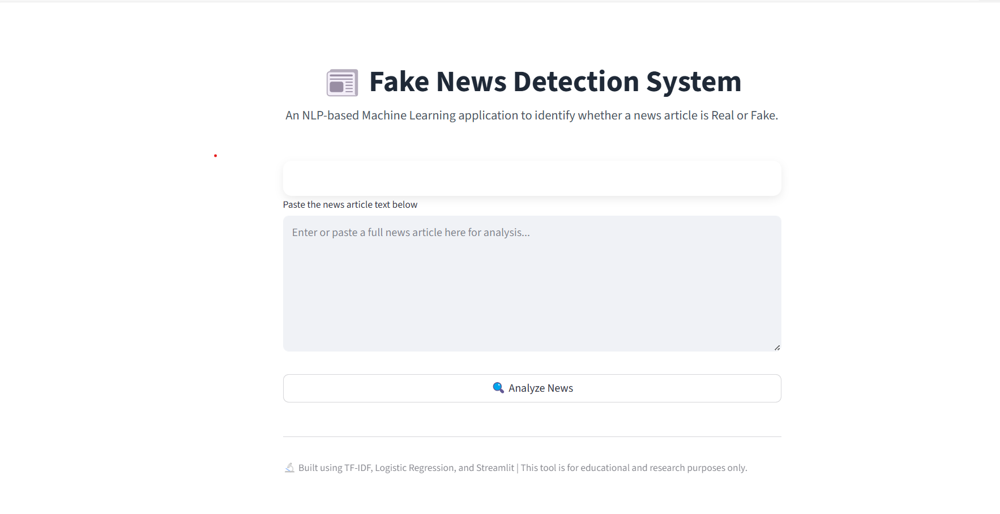
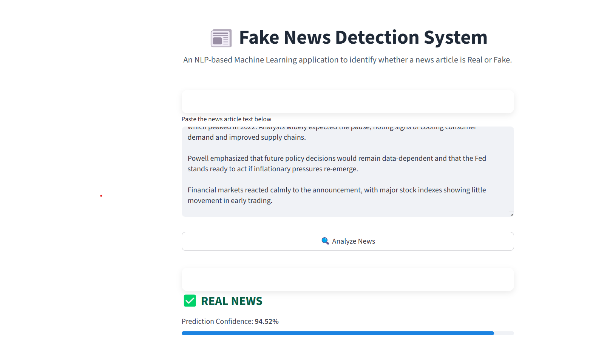
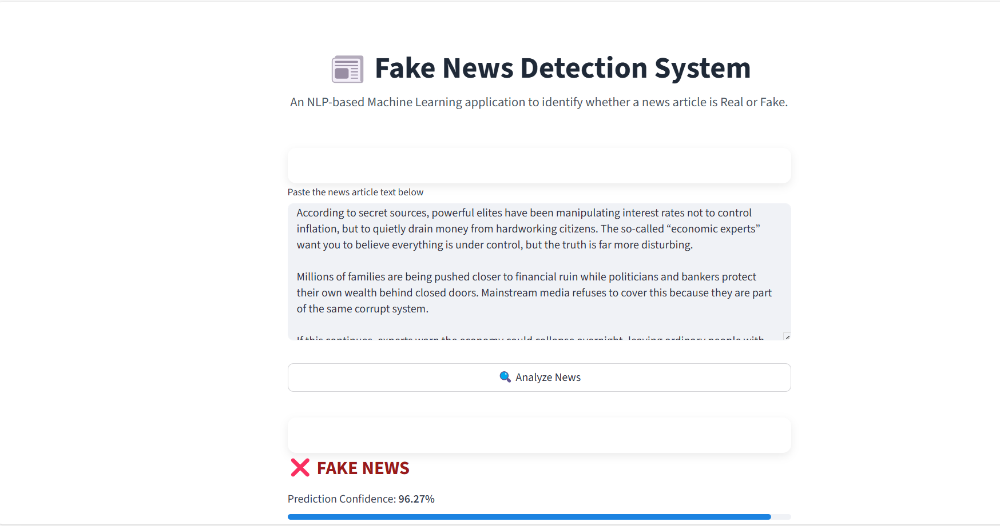

# 📰 Fake News Detection System

An end-to-end Machine Learning application that classifies news articles as **Real** or **Fake** using Natural Language Processing (NLP) techniques.

The project includes data preprocessing, model training, evaluation, and an interactive **Streamlit web interface**, making it suitable for real-world demonstrations and portfolio use.

---

## 🚀 Live Demo
*(Optional: Add Hugging Face Spaces link after deployment)*

---

## 📸 Application Screenshots

### Home Page


### Real News Prediction


### Fake News Prediction


---

## 🧠 Project Overview

Fake news has become a major challenge in the digital era.  
This system analyzes the **linguistic patterns** of a news article and predicts whether it is likely to be real or fake.

> ⚠️ **Note:**  
> This system performs **text-based classification**, not factual verification against live sources.

---

## 🛠️ Tech Stack

- Python
- Pandas, NumPy
- Scikit-learn
- TF-IDF Vectorization
- Logistic Regression
- Streamlit

---

## 📂 Dataset

This project uses the **Fake and Real News Dataset** from Kaggle.

🔗 Dataset Link:  
https://www.kaggle.com/datasets/clmentbisaillon/fake-and-real-news-dataset

The dataset contains approximately 44,000 labeled news articles:
- `Fake.csv` – Fake / misleading news articles
- `True.csv` – Real news articles (Reuters-style)

⚠️ **Note:**  
Dataset files are not included in this repository due to GitHub file size limits and best practices.  
Please download the dataset directly from Kaggle and place the CSV files inside the `data/` folder.

---

## ⚙️ Model Pipeline

1. Text cleaning and normalization
2. TF-IDF vectorization
3. Logistic Regression classifier
4. Hyperparameter tuning using GridSearchCV
5. Model evaluation using precision, recall, F1-score, and confusion matrix

---

## 📊 Model Performance

| Metric | Score |
|------|------|
| Accuracy | **99%** |
| Precision | **0.99** |
| Recall | **0.99** |
| F1-score | **0.99** |

### Confusion Matrix
[[4632 64]
[ 42 4242]]

yaml
Copy code

---

## 🖥️ How to Run Locally

### 1️⃣ Install dependencies
```bash
pip install -r requirements.txt
2️⃣ Train the model
bash
Copy code
python train_model.py
3️⃣ Run Streamlit app
bash
Copy code
streamlit run streamlit_app.py
⚠️ Limitations
The model detects writing style patterns, not factual truth

Performance may be inflated due to stylistic differences in the dataset

Real-world deployment would require:

More diverse datasets

Source verification

Fact-checking mechanisms

📌 Future Improvements
Add live news input (RSS feeds)

Incorporate source credibility analysis

Use transformer-based models (BERT)

Multi-language support

👤 Author
Sumit

